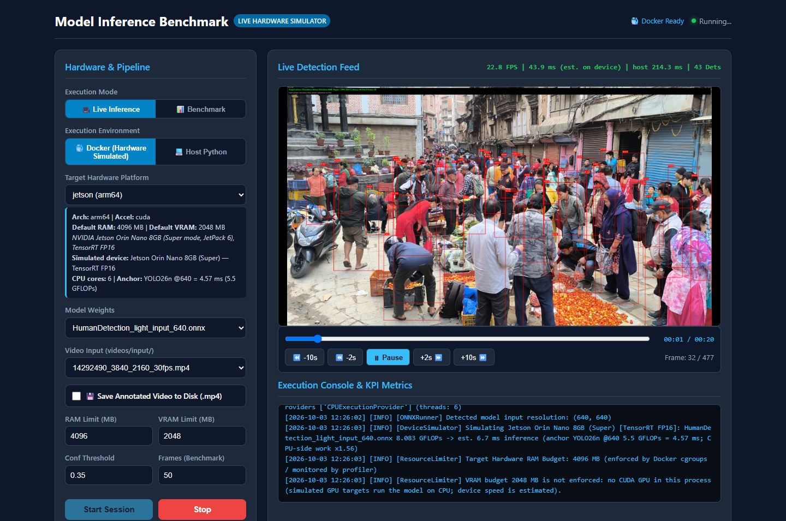
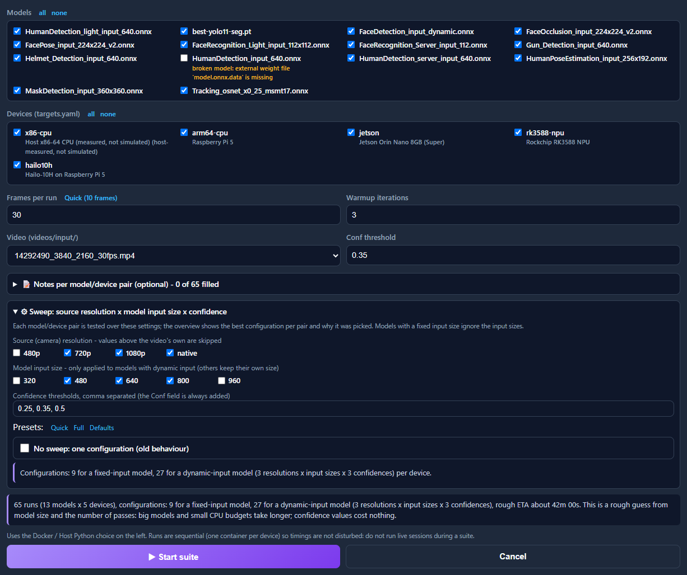
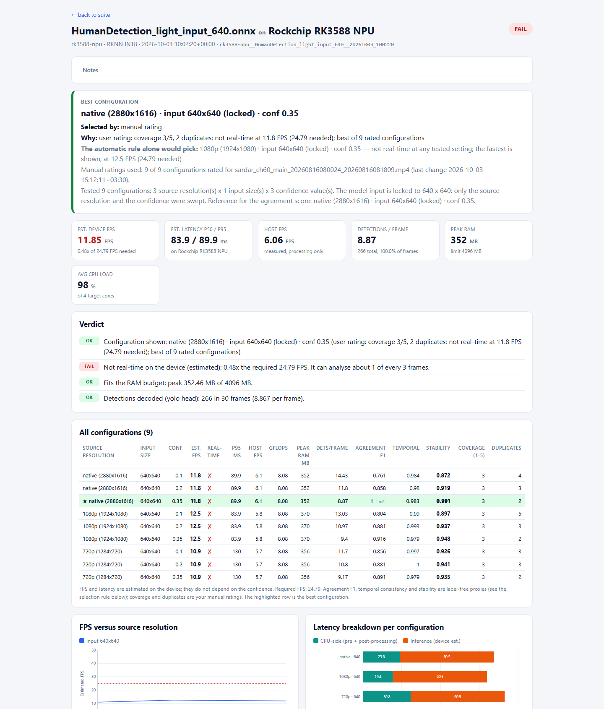
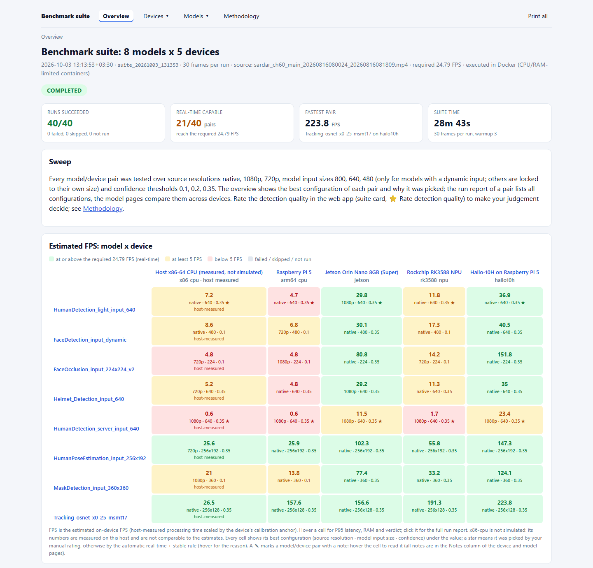
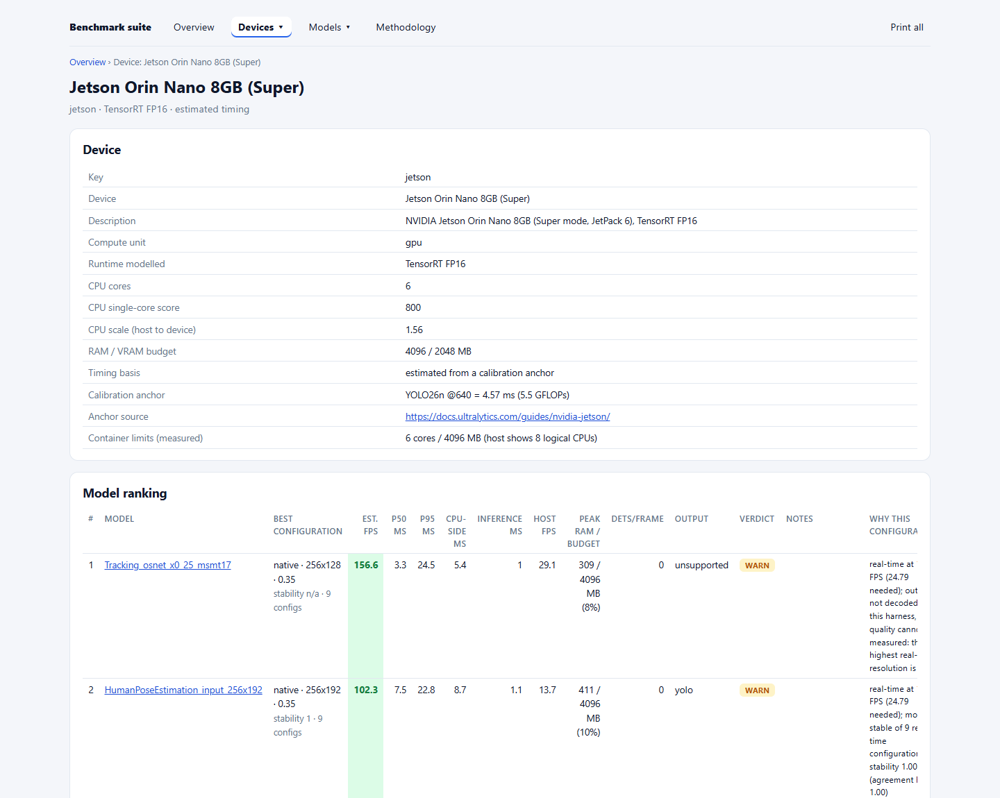
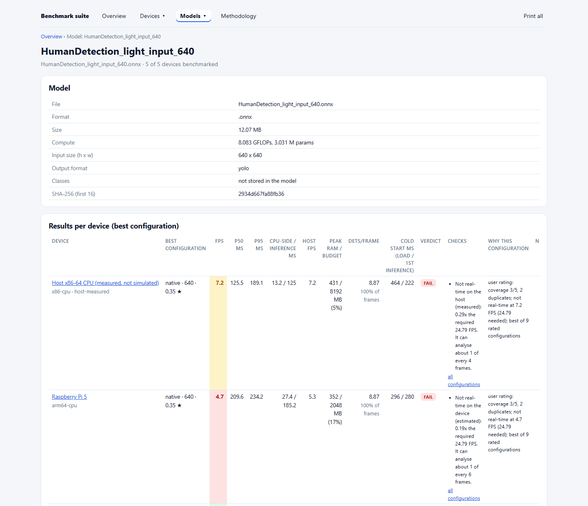

# Model Inference Benchmark

**Benchmark object-detection models on simulated edge hardware (Raspberry Pi 5, Jetson Orin Nano, Rockchip RK3588 and Hailo-10H) before you buy the boards.**



<sub>Live inference on the simulated Jetson Orin Nano: 43 people detected, estimated 22.8 FPS on the device, 214 ms per frame measured on the host.</sub>

Model Inference Benchmark runs your models for real, inside Docker containers limited to each device's CPU cores and RAM, and estimates how fast they would run on the device's GPU or NPU from published benchmarks. You get live playback at the device's speed, one-click exportable reports, and a multipage report that compares every model on every device. Each pair is tested over camera resolutions, model input sizes and confidence thresholds, and the report shows the best setting for each.

---

## Contents

- [Highlights](#highlights)
- [Screenshots](#screenshots)
- [Simulated devices](#simulated-devices)
- [How the simulation works](#how-the-simulation-works)
- [Getting started](#getting-started)
- [Using the app](#using-the-app)
- [Command line](#command-line)
- [Reports and output files](#reports-and-output-files)
- [Configuration](#configuration)
- [Supported models](#supported-models)
- [Project structure](#project-structure)
- [Limitations](#limitations)

## Highlights

- **Five targets out of the box:** an x86 host baseline, Raspberry Pi 5, Jetson Orin Nano 8GB (Super), RK3588 NPU and Hailo-10H. Each runs in a container with the device's core count and RAM budget.
- **Real detections, estimated device speed.** The model really runs, so boxes, RAM use and CPU load are measured. On-device latency is scaled from a published benchmark of that exact device.
- **Live player** with seek, pause and an overlay of estimated device FPS next to the host's real latency. Playback slows to the device's speed when the host is faster.
- **One-click benchmark reports:** a self-contained HTML report plus JSON, per-frame CSV, a Markdown summary and annotated sample frames, downloadable as a ZIP.
- **Benchmark all scenarios:** every model on every device, with live progress, Stop and Resume, and a multipage report site (overview, one page per device and per model, methodology, printable all-pages document).
- **Sweeps:** camera resolution × model input size × confidence threshold. Each threshold is applied to the stored boxes instead of re-running the model, so extra thresholds cost almost no time. The report names the best setting for each model/device pair and says why it won.
- **Your judgement counts:** rate the detection quality of any setting (coverage 1–5 and duplicate boxes), and your ratings drive the best-setting choice. Add notes per model/device pair; they appear as a column in every report.
- **Instant estimates:** a model × device table of expected FPS computed from model size alone, with no inference.

## Screenshots

<table>
<tr>
<td width="50%"><br><sub><b>Benchmark All Scenarios</b>: pick models, devices, frames, the sweep settings and optional notes. It shows the run count and a rough ETA.</sub></td>
<td width="50%"><br><sub><b>Run report</b>: the best setting and why it won, all tested settings with stability and your ratings, and charts.</sub></td>
</tr>
</table>

**Multipage suite report.** The overview shows the estimated FPS of each model on each device, coloured by whether it keeps up in real time, with the best setting under every value:



<table>
<tr>
<td width="50%"><br><sub><b>Device page</b>: specs, calibration source and container limits, and every model ranked on that device.</sub></td>
<td width="50%"><br><sub><b>Model page</b>: model details and how it performs on every device, with checks and the reason for each best setting.</sub></td>
</tr>
</table>

## Simulated devices

| Target | Simulated device | Runtime modelled | CPU cores | RAM budget | Calibration anchor (640×640, inference only) |
|---|---|---|---|---|---|
| `x86-cpu` | Host machine (measured, not simulated) | ONNX Runtime / PyTorch | all | 8 GB | — |
| `arm64-cpu` | Raspberry Pi 5 | ONNX Runtime CPU, FP32 | 4 | 2 GB | YOLO26n: 126 ms ([Ultralytics](https://docs.ultralytics.com/guides/raspberry-pi/)) |
| `jetson` | Jetson Orin Nano 8GB (Super) | TensorRT FP16 | 6 | 4 GB (+2 GB VRAM) | YOLO26n: 4.57 ms ([Ultralytics](https://docs.ultralytics.com/guides/nvidia-jetson/)) |
| `rk3588-npu` | Rockchip RK3588 (Radxa Rock 5B) | RKNN INT8 | 4 | 4 GB | YOLO26n: 41.2 ms ([Ultralytics](https://docs.ultralytics.com/integrations/rockchip-rknn/)) |
| `hailo10h` | Hailo-10H on a Raspberry Pi 5 | HailoRT INT8 | 4 | 4 GB | YOLOv8n: 2.67 ms ([Hailo Model Zoo](https://github.com/hailo-ai/hailo_model_zoo/blob/master/docs/public_models/HAILO10H/HAILO10H_object_detection.rst)) |

Devices are defined in [`targets.yaml`](targets.yaml); add your own or recalibrate with your own measurements (see [Configuration](#configuration)).

## How the simulation works

Every benchmark has two layers:

1. **Functional (measured).** The `.onnx` or `.pt` model runs on the host inside the target's Docker service. The service is capped at the device's CPU cores (`cpus`) and RAM (`mem_limit`), and the runtime uses that many threads. Detections, confidences, RAM, CPU load, model load time and pre/post-processing time are measured.
2. **Timing (estimated).** On-device latency comes from the device's calibration anchor:
   - `inference = max(min_inference_ms, anchor_ms × model_GFLOPs / anchor_GFLOPs)`. GFLOPs are counted from the model graph, at the input size actually used.
   - `pre/post-processing = host_ms × host CPU score / device CPU score`.

> [!IMPORTANT]
> Device figures are estimates, roughly ±30–50% versus real hardware. Use them to rank models and to spot the ones that can't reach real time on a device, not to sign off a deployment. Not modelled: INT8 accuracy loss, NPU operations falling back to the CPU, thermal throttling, and interface bottlenecks (for example a Hailo module on the Pi 5's single PCIe lane). Detections are the same on every simulated device, because the same weights run on the host.

## Getting started

### Prerequisites

- **Docker Desktop** (Windows/macOS) or Docker Engine with Compose v2 (Linux). The image is about 11 GB because it includes PyTorch.
- **Python 3.10+** on the host. The web app runs on the host and launches the device containers.
- **Disk space** for your models and videos.

### Install

```bash
git clone <repo-url> model-inference-benchmark
cd model-inference-benchmark
pip install -r requirements.txt

# Build the shared image once; every device service reuses docker-x86-cpu:latest
docker compose -f docker/docker-compose.yml build x86-cpu
```

### Add models and videos

The repository ships the harness only. Put your files here (both folders are git-ignored):

| Folder | What goes in it |
|---|---|
| `models/` | `.onnx` and Ultralytics `.pt` detection models (see [Supported models](#supported-models)) |
| `videos/input/` | Test footage: `.mp4`, `.avi`, `.mkv` or `.mov` |

### Run

```bash
python app.py                 # opens http://localhost:5000
python app.py --port 5050 --no-browser
```

Keep **Docker (Hardware Simulated)** selected in the sidebar to run on the simulated devices. **Host Python** runs the same code directly on your machine, with no device limits.

## Using the app

### Live inference

Pick a **target**, a **model** and a **video**, then press **Start Session**. The feed shows boxes and an overlay with the device's estimated FPS and latency next to the host's measured latency. Pause, seek (±2 s and ±10 s, or drag the timeline) and Stop work at any time. Tick **Save Annotated Video** to also write an `.mp4` to `videos/output/`.

### Benchmark & export a report

Press **📊 Benchmark & Export Report** to benchmark the selected model on the selected device. In **Benchmark** mode you can Ctrl/Shift-click several models to get one report each. When a run finishes, a report card shows the verdict, the key numbers and the export links: **Download ZIP**, **Open HTML report**, JSON, CSV and Summary. Every earlier run stays in **Past Reports**, filterable by device and model.

### Benchmark all scenarios

Press **🧮 Benchmark All Scenarios**, tick the models and devices (broken or device-native models are flagged), and choose the frames per run and the sweep. **Quick** uses 10 frames. While it runs you get:
- an overall progress bar with an ETA;
- the current device, model and setting;
- a live model × device grid that fills in as runs finish.

**Stop** keeps a partial report, and **Resume** reruns only what's missing. The finished suite card links to the multipage report, a print-all page (for a browser PDF), the ZIP, and CSV/JSON. Earlier suites are listed under **Benchmark Suites**.

> [!TIP]
> Don't run live sessions while a suite or benchmark runs. Timings are measured on the host, so other load inflates them.

### Sweeps and the best setting

Each benchmark tests every model/device pair over a sweep, set in the **Sweep** box or in `configs/detection.yaml`:

| Dimension | Default | Notes |
|---|---|---|
| Camera resolution | 720p, 1080p, native | Frames are downscaled outside the timed section; heights above the video's own are skipped |
| Model input size | 480, 640, 800 | Only for models with a dynamic input (Ultralytics `.pt`, ONNX with symbolic H/W). Fixed-size models are marked *locked* |
| Confidence | 0.25, 0.35, 0.50 | No extra inference: the run uses the lowest threshold and filters for the others. This gives exactly the boxes of a run at that threshold (verified by `scripts/check_sweep_equivalence.py`) |

Presets: **Quick**, **Full** and **Defaults**. **No sweep** gives a single-setting run. The best setting for each pair is chosen in this order:

1. **Your ratings**, if you entered any for that video and model: highest coverage, then fewest duplicates, then real-time, then stability.
2. Otherwise, among the settings that keep up in **real time**, the most **stable** wins. Stability is the average of two label-free scores: agreement with the most detailed setting, and how consistent the boxes are from frame to frame.
3. If no setting keeps up, the fastest is shown and flagged as not real-time.

### Rate detection quality

Press **⭐ Rate detection quality** on a report card, in Past Reports or on a suite card. Every tested setting is shown with the **same sample frames**, so you can compare them side by side. For each setting enter:
- **Coverage (1–5):** 5 means everyone is found, including people far back or partly covered.
- **Duplicates:** the number of duplicate boxes you see.

Saving updates every affected report and suite without re-running a model. Ratings apply to all devices and to future runs of the same video and model.

### Notes

Both benchmark panels have an optional **📝 Notes** section with one text box per model/device pair. Notes appear as a **Notes** column in every report: HTML, JSON, CSV, Markdown summary, Past Reports and the suite pages. Empty notes leave the cell empty. Text in any language, including right-to-left scripts, is supported.

### Instant estimates

**📐 Estimate All Models × Targets** computes the estimated model-only inference time and FPS of every model on every device from its GFLOPs, with no inference run. It's useful for a first cut before benchmarking.

## Command line

Everything in the app is also scriptable. Run inside a device's container:

```bash
# One model on one simulated device, with the default sweep → results/reports/<id>/
docker compose -f docker/docker-compose.yml run --rm -T rk3588-npu python scripts/run_benchmark.py \
  --target rk3588-npu --model models/your_model.onnx --video videos/input/clip.mp4 --frames 50

# Every model on every device → results/reports/suite_<timestamp>/index.html
python scripts/run_benchmark_matrix.py --targets all --models all --frames 30 --video videos/input/clip.mp4
python scripts/run_benchmark_matrix.py --resume suite_20261003_131353       # finish a stopped suite
python scripts/run_benchmark_matrix.py --render-only suite_20261003_131353  # rebuild the pages

# Instant model × device estimates (no inference)
python scripts/estimate_models.py

# Manual ratings
python scripts/rate_configs.py show --suite suite_20261003_131353
python scripts/rate_configs.py set --video clip.mp4 --model m.pt --source 720p --input 640x640 --conf 0.35 --coverage 5 --duplicates 0
python scripts/rate_configs.py clear --model m.pt

# Plain inference on a video (writes an annotated copy)
python scripts/run_inference.py --target jetson --docker --model models/your_model.onnx \
  --video videos/input/clip.mp4 --output videos/output/annotated.mp4
```

<details>
<summary><b>Benchmark flags</b></summary>

| Flag | Meaning |
|---|---|
| `--target` | Device key from `targets.yaml` (`--list-targets` lists them) |
| `--model` | One or more model paths; several models get one report each |
| `--video` | Input video (synthetic frames when omitted) |
| `--frames`, `--warmup` | Frames measured per setting, and warm-up iterations |
| `--conf` | Confidence threshold (always part of the sweep) |
| `--source-heights` | Camera resolutions, e.g. `720 1080 native` |
| `--input-sizes` | Model input sizes, e.g. `480 640 800` or `default` |
| `--conf-thresholds` | Thresholds, e.g. `0.25 0.35 0.5` |
| `--sweep-preset quick\|full`, `--no-sweep` | Sweep presets, or a single setting |
| `--notes "text"`, `--notes-file notes.json` | Notes per pair; the file format is `{"model.onnx": {"jetson": "text"}}` |
| `--docker` | From the host: dispatch the run into the target's container |
| `--max-ram-mb`, `--max-vram-mb` | Override the RAM/VRAM budget that is monitored |
| `--no-report` | Skip the report bundle |

`run_benchmark_matrix.py` takes `--targets`, `--models`, `--frames`, `--warmup`, `--video`, `--conf`, the same sweep flags, `--notes-file`, `--local` (host instead of Docker), `--resume <suite_id>` and `--render-only <suite_id>`. Ctrl+C stops a suite cleanly, and a model that fails to load gives a *failed* cell instead of stopping the suite.

</details>

## Reports and output files

Everything is written under `results/` (git-ignored).

| Path | Content |
|---|---|
| `results/reports/<target>__<model>__<time>/` | One benchmark: `report.html` (self-contained, no external files), `report.json`, `frames.csv` (one row per setting and frame), `summary.md` and `samples/*.jpg` |
| `results/reports/suite_<time>/` | One suite: `index.html` (overview), `devices/*.html`, `models/*.html`, `method.html`, `print.html`, `runs/<id>/` (every pair's full report), `results.csv` / `results.json` (one row per pair and setting) and `suite.json` (manifest) |
| `results/ratings/ratings.json` | Your detection-quality ratings |
| `results/metrics/` | Flat JSON/CSV summaries of single benchmarks |

All report pages use inline CSS and SVG, relative links and no scripts or CDNs, so a report folder can be zipped, e-mailed or opened straight from disk. Print a page, or `print.html`, from the browser to get a PDF.

<details>
<summary><b>What a report contains</b></summary>

- **Speed:** estimated device FPS and latency (P50/P90/P95/P99), the host's measured latency and FPS, and a breakdown into decode, pre-processing, inference and post-processing.
- **Start-up cost:** model load time and first-inference latency.
- **Detections:** per frame and per class, confidence statistics, and the share of frames with at least one detection.
- **Resources:** peak RAM against the device's budget, and CPU load as a share of the device's cores.
- **Real-time verdict:** the required FPS is `benchmark.required_fps`, else the video's FPS, else 25. Below real time, the report states how many frames the device would analyse (e.g. "about 1 of every 4").
- **Sweep:** every tested setting with agreement, frame-to-frame consistency, stability and your ratings; the best setting, the rule that chose it and the reason; charts of FPS against resolution, the latency breakdown, and detections and stability against threshold.
- **Context:** model details (format, size, GFLOPs, parameters, input size, output format, a file fingerprint), the device and its calibration anchor, the environment and container limits, notes, and the method with its accuracy disclaimer.

`report.json` (schema 1.0) keeps the best setting's results at the top level and adds a `sweep` section with every setting.

</details>

## Configuration

**`targets.yaml`** defines the devices. Each has a `hardware` block with the calibration anchor:

```yaml
jetson:
  ram_limit_mb: 4096
  vram_limit_mb: 2048
  description: "NVIDIA Jetson Orin Nano 8GB (Super mode, JetPack 6), TensorRT FP16"
  hardware:
    device: "Jetson Orin Nano 8GB (Super)"
    compute_unit: gpu
    runtime: "TensorRT FP16"
    cpu_cores: 6
    cpu_single_core_score: 800       # Geekbench 6 single-core, scales pre/post-processing
    min_inference_ms: 1.0
    reference:                       # published benchmark the estimate is scaled from
      model: YOLO26n @640
      gflops: 5.5
      latency_ms: 4.57
      source: "https://docs.ultralytics.com/guides/nvidia-jetson/"
```

- **Recalibrating:** replace `reference` with your own on-device measurement for better estimates. On a different host machine, update `simulation.host.cpu_single_core_score` too.
- **Keep the container limits in sync:** `cpu_cores` and `ram_limit_mb` must match `cpus` and `mem_limit` of the same service in [`docker/docker-compose.yml`](docker/docker-compose.yml).
- **`configs/detection.yaml`** holds the default confidence, IoU and input size, the default sweep (`benchmark.sweep`) and an optional `benchmark.required_fps`.

## Supported models

| Format | Status |
|---|---|
| `.onnx` with a YOLOv8/YOLO11 head (`[1, 4+classes, anchors]`) | Detections decoded; class names read from Ultralytics metadata |
| `.onnx` with an end-to-end head (`[1, N, 6]`, YOLOv10/YOLO26 style) | Detections decoded |
| Ultralytics `.pt` (detection or segmentation) | Detections decoded; any input size |
| Other `.onnx` outputs (face, pose, embedding, classification…) | Timed and estimated; marked *output not decoded* instead of reporting 0 detections |
| `.engine`, `.rknn`, `.hef` | Device-native formats; need the vendor runtime on real hardware, so they're skipped in simulation |

Models with a fixed input size in the graph only sweep camera resolution and threshold. Export with dynamic height and width (for example `yolo export model=best.pt format=onnx dynamic=True`) to include input size in the sweep.

## Project structure

```text
model-inference-benchmark/
├── app.py                  # Web app: live player, benchmarks, suites, ratings (stdlib HTTP server)
├── targets.yaml            # Simulated devices and calibration anchors
├── configs/detection.yaml  # Detection defaults, sweep defaults, required FPS
├── docker/                 # Dockerfiles and docker-compose.yml (one service per device)
├── scripts/                # CLI: run_benchmark, run_benchmark_matrix, estimate_models, rate_configs,
│                           #      run_inference, run_live_stream, check_sweep_equivalence
├── src/
│   ├── runtimes/           # ONNX Runtime and Ultralytics runners (+ TensorRT, RKNN, Hailo adapters)
│   ├── simulation/         # GFLOPs profiler, device latency model, simulated detector, estimates
│   ├── benchmark/          # Profiler, sweeps, report/suite builders, HTML pages, ratings
│   ├── video/              # Video reader and annotator
│   └── utils/              # Logging, resource limits, Docker helpers
├── models/                 # Your models (git-ignored)
├── videos/input, output/   # Your videos and annotated output (git-ignored)
├── results/                # Reports, suites, ratings, metrics (git-ignored)
└── docs/images/            # README screenshots
```

## Limitations

- Device speeds are **estimates** scaled from one published benchmark per device; see [How the simulation works](#how-the-simulation-works).
- **Detections come from the host's FP32 run.** Quantization effects on the NPUs (INT8) aren't reproduced.
- **Without labelled data the automatic best setting is a proxy.** Rate a few settings to make it reflect real detection quality.
- **Every device service uses the same x86 image.** ARM-specific behaviour (wheels, kernels) isn't exercised.
- **The `web` service in `docker-compose.yml`** runs the app in a container, but it can't start the device containers from there. Run `python app.py` on the host instead.
